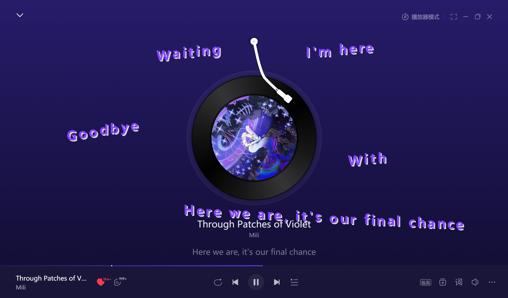
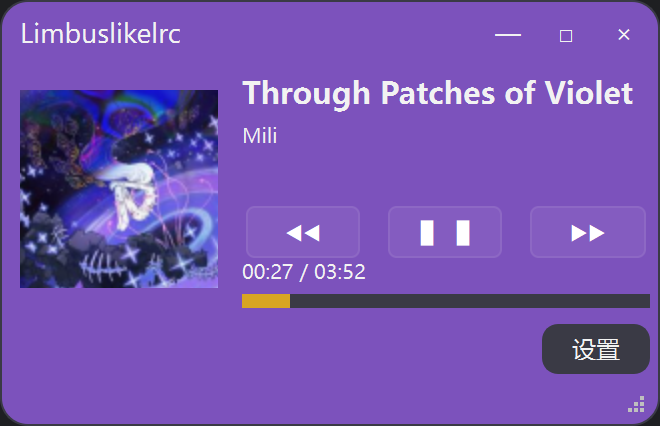
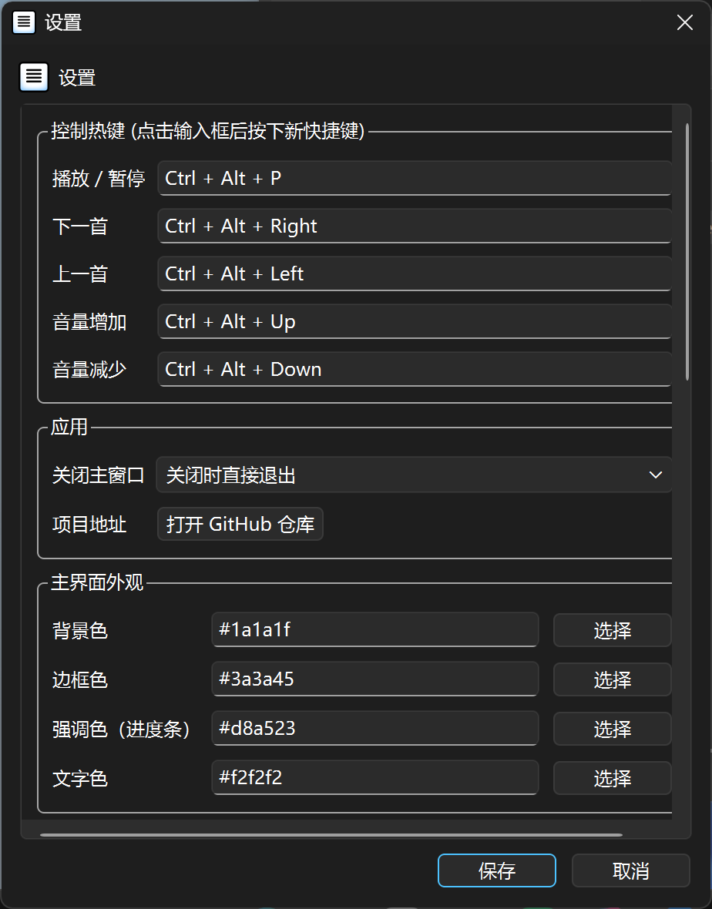

# Limbuslikelrc

受 **Limbus Company** 风格启发的网易云音乐桌面歌词悬浮窗。

自动识别当前播放歌曲与进度 → 获取 LRC 歌词 → 以逐字出现、抖动、描边、随机倾斜的方式显示在全屏透明悬浮层上。

## 界面预览





## 功能

- 通过网易云本地日志（`cloudmusic.elog`）识别当前歌曲、歌手（无需额外插件）
- **同时支持桌面版和 Microsoft Store 版网易云音乐**
- 实时监听播放/暂停状态，同步真实播放进度（支持中途启动、拖动进度条）
- 自动获取并解析 LRC 歌词，过滤「作词/作曲」等非歌词元信息
- 全屏歌词逐字出现、抖动、描边、随机倾斜动画
- **主界面**：显示封面、歌曲名、歌手、进度条、总时长，支持拖拽缩放
- **播放控制**：主界面内置“上一首/播放暂停/下一首”按钮，直接控制网易云音乐播放
- **自定义热键**：支持自定义全局快捷键（播放/暂停、切歌、音量控制），默认与网易云客户端一致
- **系统托盘**：后台驻留，双击显示主界面；支持一键导出日志至桌面
- **设置对话框**：可视化调节字体、颜色、动画参数、热键、关闭行为等，设置自动保存
- 手动时间偏移（`LYRIC_MANUAL_OFFSET`）

## 系统要求

- **仅支持 Windows**
- 已安装并运行 [网易云音乐](https://music.163.com/) 桌面客户端或 Microsoft Store 版（建议 3.x 及以上）
- Python 3.9+
- 客户端至少运行过一次，以生成本地 `%LOCALAPPDATA%\NetEase\CloudMusic\cloudmusic.elog`

## 安装

```bash
git clone https://github.com/LKornway/Limbuslikelrc.git
cd Limbuslikelrc
pip install -r requirements.txt
```

## 运行

```Bash
python main.py
```
- 按 Esc 退出全屏歌词悬浮窗（同时退出程序）
- 主窗口可拖拽、缩放，关闭时默认最小化到托盘（首次询问）


## 配置

- 可视化设置：点击主窗口右下角的「设置」按钮，可调节歌词外观、动画参数、关闭行为等，所有修改即时生效并持久化保存。
- 热键自定义：在设置页面点击热键输入框，按下新的组合键即可录入（必须包含至少一个修饰键：Ctrl/Alt/Shift）。
- 手动配置文件：config.py 提供所有默认值，设置界面修改后会覆盖这些默认值，并保存到 %APPDATA%\Limbuslikelrc\settings.json。
- 常用参数：
    - LYRIC_MANUAL_OFFSET：手动时间偏移（正数提前，负数延后）
    - 字体、颜色、抖动强度、倾斜角度、逐字出现间隔等
## 项目结构

```text
Limbuslikelrc/
├── main.py                 # 程序入口
├── config.py               # 默认配置（会被用户设置覆盖）
├── requirements.txt        # Python 依赖
├── Limbuslikelrc.spec      # 打包配置（可选）
├── assets/                 # 图标与预览图
│   └── app.ico             # 应用图标（含多尺寸）
├── libs/                   # 本地第三方库
│   └── cloudmusic_detector/   # 修改版网易云状态监听库（支持桌面版和 Store 版）
├── core/                   # 核心功能模块
│   ├── __init__.py
│   ├── cloudmusic_watcher.py   # 本地 elog 监听（歌曲/播放暂停/进度）
│   ├── netease_source.py       # 歌词请求与下发
│   ├── lrc_parser.py           # LRC 解析与元信息过滤
│   ├── models.py               # 歌词与字符状态数据模型
│   ├── settings_store.py       # 用户设置持久化（读写 JSON）
│   ├── cloudmusic_controller.py # 播放控制（模拟全局快捷键）
│   └── logger.py               # 日志管理（轮转与导出）
└── ui/                     # 界面模块
    ├── __init__.py
    ├── main_window.py          # 主窗口（封面、进度条、控制按钮、托盘等）
    ├── overlay.py              # 全屏歌词悬浮窗与逐字动画
    └── settings_dialog.py      # 设置对话框（含热键自定义）
```

## 工作原理（简要）

1. core/cloudmusic_watcher.py 通过修改后的 cloudmusic_detector 库读取网易云本地日志，获取当前歌曲、播放状态与进度，同时兼容桌面版和 Store 版。
2. core/netease_source.py 在切歌后请求 LRC，并由 core/lrc_parser.py 解析。
3. ui/overlay.py 按时间轴渲染逐字动画；拖动进度条时仅恢复当前仍应可见的歌词，避免历史句子一次铺满。
4. core/cloudmusic_controller.py 通过模拟全局快捷键控制网易云音乐播放，支持自定义热键。
5. core/logger.py 提供日志轮转与导出功能，便于问题反馈与调试。

## 已知限制

- 目前仅支持 Windows 系统。
- 仅支持网易云音乐桌面客户端或 Microsoft Store 版。
- 播放状态依赖本地 cloudmusic.elog，若文件缺失或客户端版本差异较大可能无法正确识别。
- 歌词内容依赖网易云网络接口，需要网络连接。

## 许可证

本项目采用 MIT License。